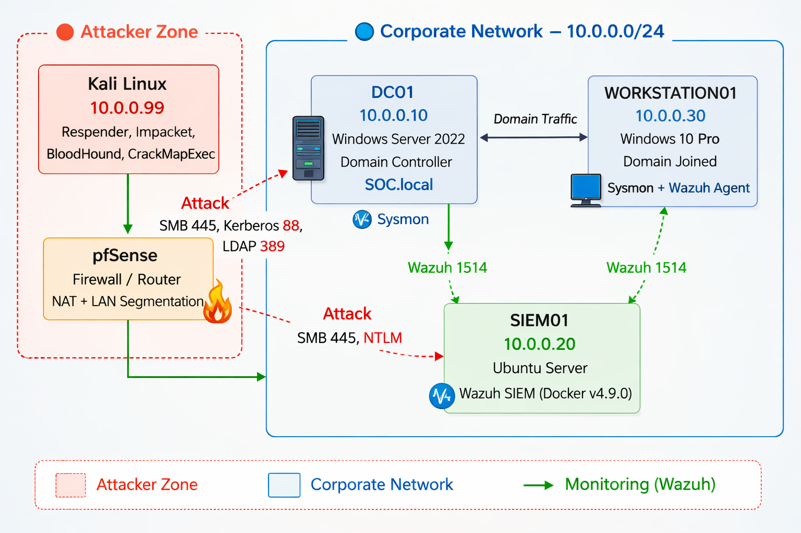

# Enterprise AD Compromise Simulation & Detection

## Project Overview
This project simulates a **realistic Active Directory compromise** — from initial network reconnaissance to full Domain Admin takeover — while simultaneously building a **detection engineering layer** on top of Wazuh SIEM.

Every attack is mapped to **MITRE ATT&CK**, detected via **custom Wazuh rules**, and documented with full attack playbooks, response runbooks, and incident report.

---

## Architecture Diagram


```
                          ┌────────────────────────┐
                          │      pfSense FW        │
                          │ (VLAN/Static Routing)  │
                          └─────┬────────────┬─────┘
                                │            │
   ┌────────────────────────────▼──┐  ┌──────▼─────────────────────┐
   │      LAN CORPORATE ZONE       │  │     LAN ATTACKER ZONE      │
   │      (Internal Network)       │  │     (Untrusted Network)    │
   │                               │  │                            │
   │  ┌─────────────────────────┐  │  │  ┌──────────────────────┐  │
   │  │   Windows Server 2022   │  │  │  │      Kali Linux      │  │
   │  │   (Domain Controller)   │  │  │  │    (Threat Actor)    │  │
   │  │       SOC.local         │  │  │  └──────────────────────┘  │
   │  └────────────┬────────────┘  │  └────────────────────────────┘
   │               │               │
   │  ┌────────────▼────────────┐  │           ┌────────────────────┐
   │  │    Windows 10 Pro       │  │           │    HYBRID CLOUD    │
   │  │    (Domain Joined)      │◄─┼──────────►│   Azure Entra ID   │
   │  └────────────┬────────────┘  │           │    (Monitoring)    │
   │               │               │           └────────────────────┘
   │  ┌────────────▼────────────┐  │
   │  │     Ubuntu Server       │  │           ┌────────────────────┐
   │  │  ┌─────────────────┐    │  │           │   EXTERNAL DATA    │
   │  │  │  Wazuh (Docker) │◄───┼──┼──────────►│  OFFSITE BACKUP    │
   │  │  ├─────────────────┤    │  │           └────────────────────┘
   │  │  │ Automated Backup│    │  │
   │  │  └─────────────────┘    │  │
   │  └─────────────────────────┘  │
   └───────────────────────────────┘
```

| Machine | OS | Role | IP |
|---|---|---|---|
| DC01 | Windows Server 2022 | Domain Controller — SOC.local | 10.0.0.10 |
| WORKSTATION01 | Windows 10 Pro | Domain-joined Victim Endpoint | 10.0.0.30 |
| SIEM01 | Ubuntu Server | Wazuh SIEM (Docker) | 10.0.0.20 |
| ATTACKER | Kali Linux | Red Team / Threat Actor | 10.0.0.99 |
| FIREWALL | pfSense | Network Segmentation & Routing | Gateway |

---

## Attack Flow


---

## Attack Simulation — Completed ✅

### Phase 1 — Initial Access
- **Technique:** LLMNR/NBT-NS Poisoning
- **Tool:** Responder
- **Result:** NTLMv2 hash captured → `testuser:Password123`
- **Detection:** Wazuh Rule 100001 — Event ID 4648
- **MITRE:** [T1557.001](https://attack.mitre.org/techniques/T1557/001/)

### Phase 2 — Credential Access
- **Technique:** Kerberoasting
- **Tool:** Rubeus v2.2.0
- **Result:** TGS ticket cracked → `svc-mssql:Password1`
- **Detection:** Wazuh Rule 100010 — Event ID 4769 RC4
- **MITRE:** [T1558.003](https://attack.mitre.org/techniques/T1558/003/)

### Phase 3 — Lateral Movement
- **Technique:** Pass-the-Hash
- **Tool:** CrackMapExec, smbclient.py
- **Result:** SMB access to WORKSTATION01 (ADMIN$, C$, IPC$)
- **Detection:** Wazuh Rule 100020/21 — Event ID 4624 NTLM
- **MITRE:** [T1550.002](https://attack.mitre.org/techniques/T1550/002/)

### Phase 4 — Privilege Escalation
- **Technique:** ACL Abuse + DCSync
- **Tool:** BloodHound CE, dacledit.py, secretsdump.py
- **Result:** All 28 domain hashes dumped including Administrator
- **Detection:** Wazuh Rule 100031 — Event ID 4662 (53 detections)
- **MITRE:** [T1003.006](https://attack.mitre.org/techniques/T1003/006/) + [T1078.002](https://attack.mitre.org/techniques/T1078/002/)

---

## Detection Engineering

| Rule ID | Level | Attack | Event ID | MITRE |
|---|---|---|---|---|
| 100001 | 10 | LLMNR Poisoning | 4648 | T1557.001 |
| 100010 | 14 | Kerberoasting | 4769 RC4 | T1558.003 |
| 100020 | 14 | Pass-the-Hash | 4624 NTLM | T1550.002 |
| 100021 | 15 | PtH CRITICAL | 4624 ×3/60s | T1550.002 |
| 100031 | 15 | DCSync | 4662 | T1003.006 |

---

## Active Response

| Trigger | Action | Timeout |
|---|---|---|
| Rule 100020/21 | firewall-drop | 300s |
| Rule 100031 | firewall-drop | 600s |

---

## MITRE ATT&CK Coverage

| Tactic | Technique | ID | Status |
|---|---|---|---|
| Initial Access | LLMNR Poisoning | T1557.001 | ✅ |
| Credential Access | Kerberoasting | T1558.003 | ✅ |
| Lateral Movement | Pass-the-Hash | T1550.002 | ✅ |
| Privilege Escalation | Domain Accounts | T1078.002 | ✅ |
| Credential Dumping | DCSync | T1003.006 | ✅ |
| Defense Evasion | ACL Modification | T1484.001 | ✅ |

---

## Project Structure
```
├── Attack-Playbooks/
│   ├── 01-LLMNR-Poisoning/
│   ├── 02-Kerberoasting/
│   ├── 03-Pass-the-Hash/
│   └── 04-Privilege-Escalation/
├── Response-Runbooks/
│   ├── runbook-llmnr.md
│   ├── runbook-kerberoasting.md
│   ├── runbook-pth.md
│   └── runbook-privesc.md
├── Evidence/
│   ├── Screenshots/
│   └── PCAP-Samples/
├── Detection/
│   └── local_rules.xml
├── Scripts/
│   ├── Setup/
│   ├── Detection/
│   └── Hardening/
├── Backup-Pipeline/
├── Azure-Integration/
├── Incident-Report/
├── Threat-Model.md
├── Architecture.svg
└── Attack-Flow.svg
```

---

## Tools

**Red Team**

| Tool | Purpose |
|---|---|
| Responder | LLMNR/NBT-NS Poisoning |
| Rubeus | Kerberos ticket abuse |
| CrackMapExec | Lateral movement |
| Impacket Suite | PtH, DCSync, SMB |
| BloodHound CE | AD attack path discovery |
| Hashcat | Offline hash cracking |

**Blue Team**

| Tool | Purpose |
|---|---|
| Wazuh 4.9.0 | SIEM + Active Response |
| Sysmon | Deep endpoint telemetry |
| pfSense | Firewall + segmentation |
| BloodHound CE | ACL misconfiguration audit |
| tcpdump | Network capture |

---

## Project Status

- [x] Lab environment setup & network segmentation
- [x] Wazuh deployment and agent configuration
- [x] Sysmon deployment on Windows machines
- [x] Phase 1 — LLMNR Poisoning + detection + playbook
- [x] Phase 2 — Kerberoasting + detection + playbook
- [x] Phase 3 — Pass-the-Hash + detection + active response
- [x] Phase 4 — Privilege Escalation + DCSync + detection
- [x] Attack Playbooks x4
- [x] Response Runbooks x4
- [x] Incident Report
- [x] Threat Model
- [x] PCAP Samples x4
- [x] Architecture + Attack-Flow diagrams
- [x] Backup Pipeline
- [x] Azure Sentinel Integration ← Coming Soon

---

## Legal Disclaimer

> This project is conducted entirely within a **self-owned, isolated lab environment** for educational and professional development purposes only.
> All techniques demonstrated are used strictly for **understanding and improving defensive security**.
> Do **not** reproduce any of these techniques on systems you do not own or have explicit written authorization to test.

---

## Author

**Othmane Benmezian**
Cybersecurity | Adversary Simulation · Blue Team · Detection Engineering · Incident Response

---

*"Offense informs defense. You can't detect what you don't understand."*
